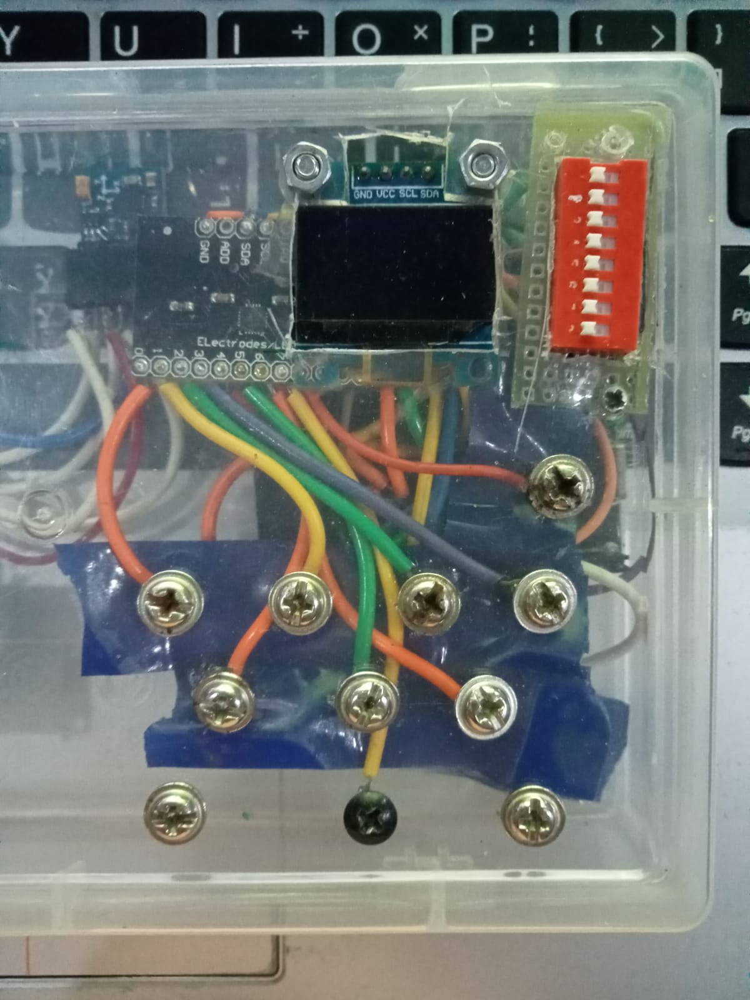
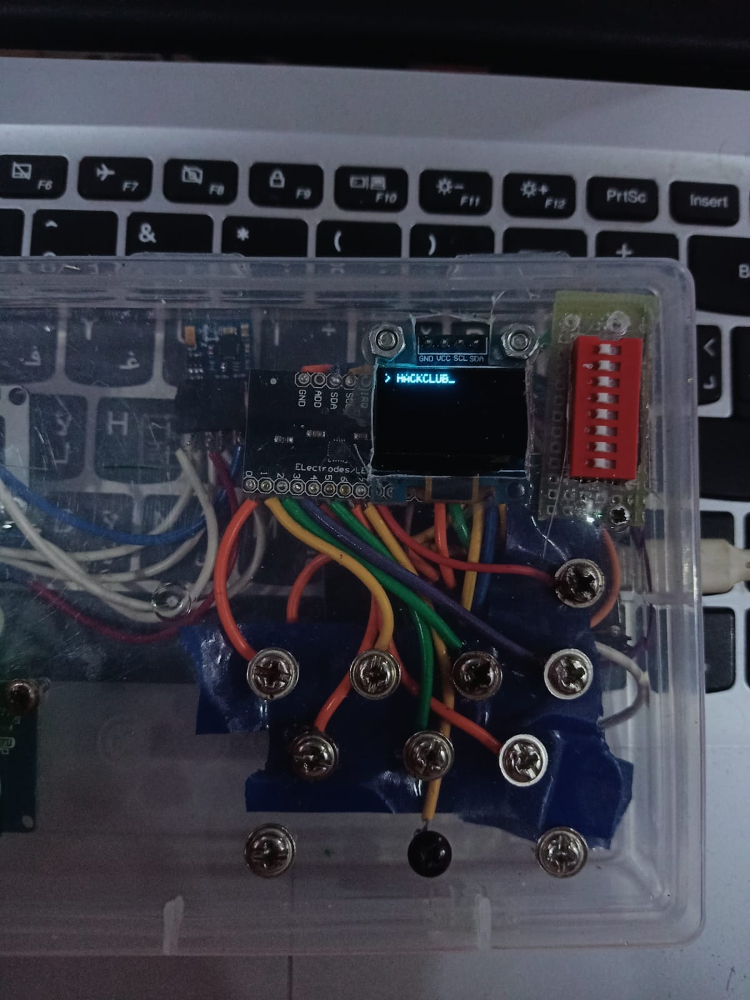
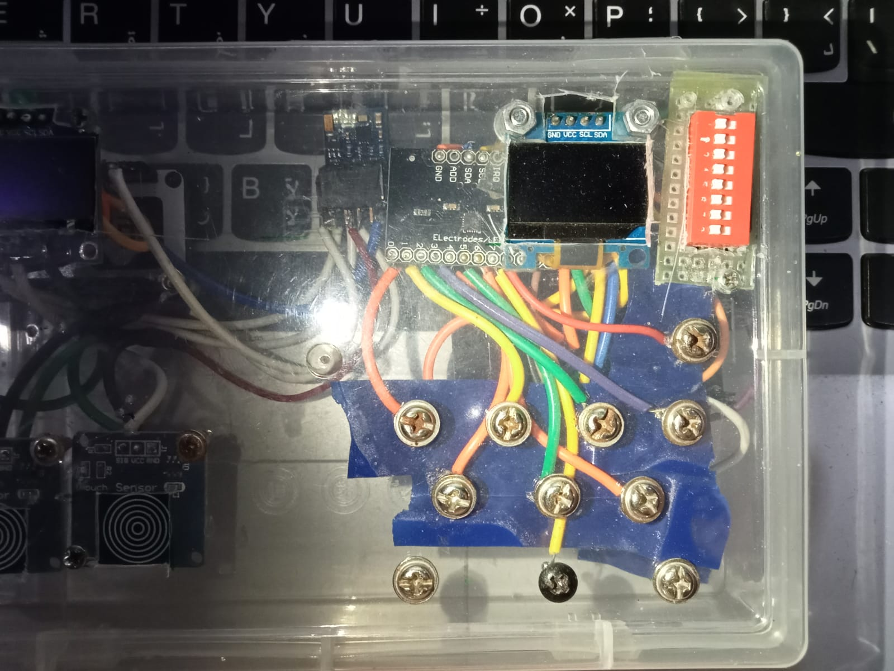
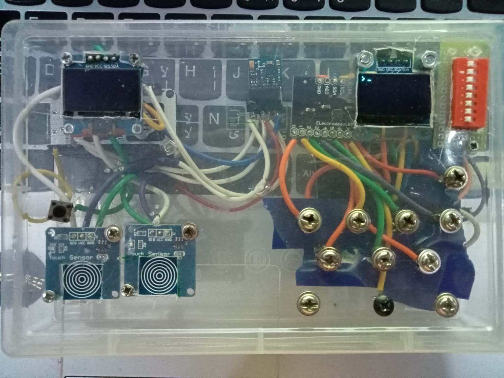
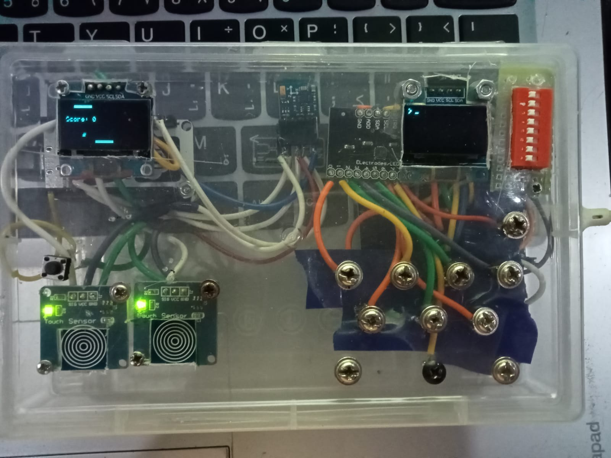
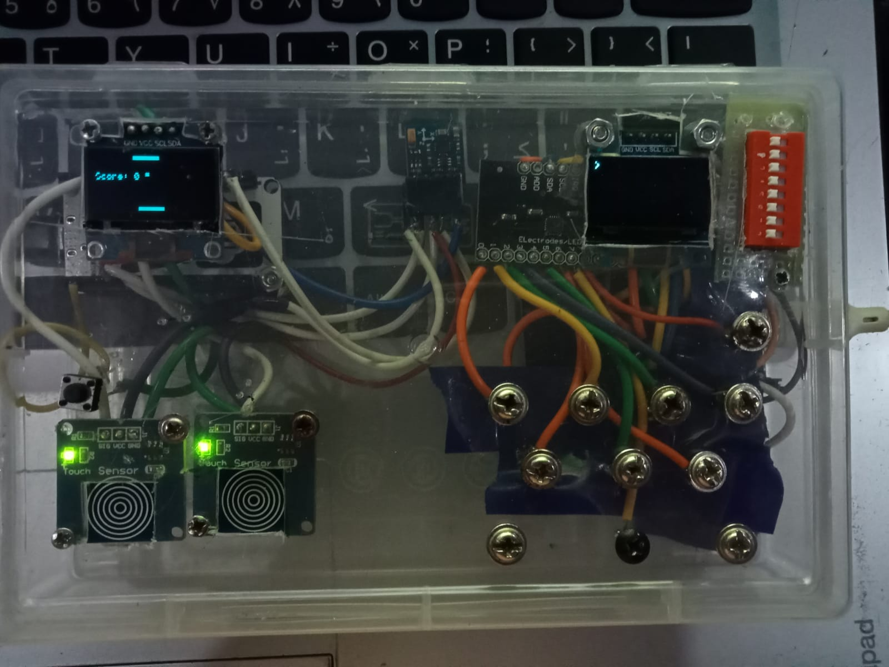
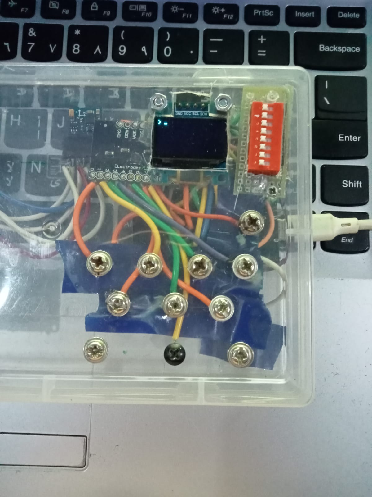
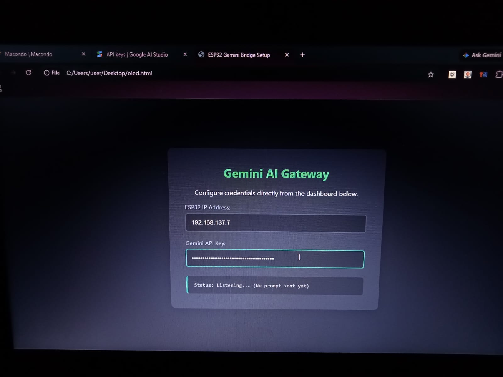

# Cosmos-001 - My Handheld AI Terminal

Hiey, I'm Jainil Patel from India! This is my project called Cosmos-001. It is basically a pocket-sized handheld machine that I built inside a clear plastic project box. It can chat with you whne connected with api keys. It also has a magnetometer. That magnetometer can sense magnetic field in the surroundings. When it senses the magnetic fields, the matrix display changes the animated patterns indicating a presence in fields.

I made this for Hack Club Macondo. I made the whole thing open source and have used plastic case and sensors and micro-controllers to act as the system.

---

## 🎥 Demo Videos & Project Files

👉 **[watch the demo videos](https://youtu.be/SLG37cFlI9c)**  
👉 **[watch the demo videos](https://youtu.be/DeMVShFD8oA)**  
👉 **[watch the demo videos](https://youtu.be/JphGT0AEgFY)**  

---

## What It Actually Does

* **Dual screens:** I added two screens for two different work. On one it has AI chatting and the other plays retro games.
* **Screw-Pad Keyboard:** I used an MPR121 capacitive touch sensor. Instead of buying a small keyboard I made one with MPR121 and copper plates.
* **Switching Modes:** I added an 8-way vertical DIP switch on the box. Flipping the switches lets us swap keyboard maps from lowercase to uppercase, symbols, or custom macros for coding.
* **Metal Finder/magnetometer:** I added a QMC5883L magnetometer sensor with an 8x8 LED matrix on top. When you move the box over a wall, the matrix lights up like a signal strength bar to help locate hidden metal screws or structural frames.
* **Haptic Buzz:** There is a tiny 5V vibration motor inside that gives a quick buzz feedback whenever a touch key registers or a prompt goes through.

---

## Hardware & Design Files

All source design files and gerbers are inside the `/hardware` folder:
* **EasyEDA Source & Schematic:** Located in `/hardware` (`.epro` / `.json`)
* **Gerber Files:** Located in `/hardware`
* **Full Parts List:** See [bom.csv](./bom.csv) for full buying list on Robu.in.

### Internal System Views

Here you can see the different stages of the build and the component placement.

---

## Mistakes I Made (Read this so you don't break your stuff)

I spent over 40 hours building, testing, and dealing with annoying bugs. Here is what I learned:

1. **Don't melt the box:** When you are building the screw keyboard, you have to solder your hookup wires directly to the backs of the metal screws while they are sitting inside the plastic casing. Work fast! If you hold your soldering iron on the screw for more than 2 seconds, the plastic box around it softens and melts instantly. My plastic box was also melted yet I somewhow managed to make it wokring.

2. **The touch Enter key was a bad idea:** I originally tried to make the "Enter" key a touch pad just like the letters. It was way too sensitive and kept double-triggering ghost presses, which sent incomplete prompts over the network and wasted my API credits. I ripped it out and put a solid, physical tactile push button there instead. The mechanical click is way safer.
3. **Leave some slack on your wires:** Space inside a tight, hand-wired clear project box disappears immediately. I cut my internal wires too short to make it look neat, but when I shoved the ESP32 into place, the tension pulled a supply wire loose. It created an uninsulated bridge across two transistor pins and crashed the whole I2C bus. Give yourself slack and use tape to keep things isolated.
4. **Isolate your magnetometer:** Keep the haptic vibration motor as far away from the magnetometer module as humanly possible. The permanent magnets inside the tiny motor will completely throw off your sensor readings every single time the engine vibrates to confirm a keystroke. Make the circuit such that no wire is around it which can cause problems and wrong readings.

---

## The Dual Screens In Action

Here you can see the two distinct display outputs I have configured.

---

## Bill of Materials (BOM)

| Item | Component | Qty | Link (Robu.in) |
| --- | --- | --- | --- |
| 1 | ESP32 Development Board | 1 | [Buy on Robu.in](https://robu.in/product/esp32-wifi-bluetooth-development-board/) |
| 2 | MPR121 Touch Sensor | 1 | [Buy on Robu.in](https://robu.in/product/mpr121-breakout-v12-capacitive-touch-sensor-controller-module-i2c-keyboard/) |
| 3 | QMC5883L Magnetometer Module | 1 | [Buy on Robu.in](https://robu.in/product/gy-271-hmc5883l-3v-5v-triple-axis-compass-magnetometer-sensor-module/) |
| 4 | 8x8 LED Matrix Module | 1 | [Buy on Robu.in](https://robu.in/product/max7219-dot-matrix-module-4-in-1-display/) |
| 5 | 5V Vibration Motor | 1 | [Buy on Robu.in](https://robu.in/product/micro-vibration-motor-10x2-7mm/) |

*(Detailed file with complete part attributes available in [bom.csv](./bom.csv).)*

---

## Credits & Thanks
This project was built during the Hack Club Macondo event. 
* Big thanks to the community for inspiration on the custom open hardware setup!
* A special thanks to my fellow friends I found on slack!